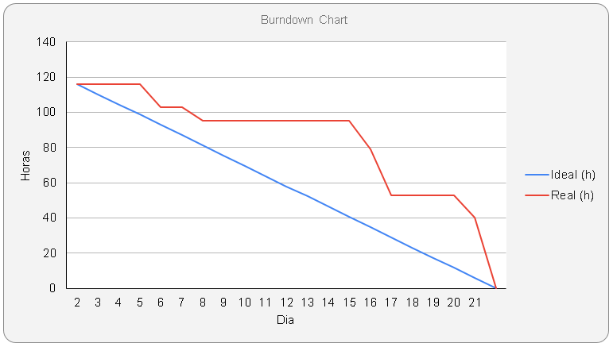
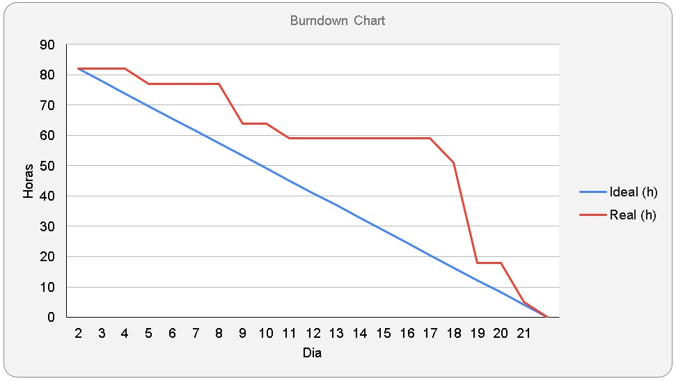
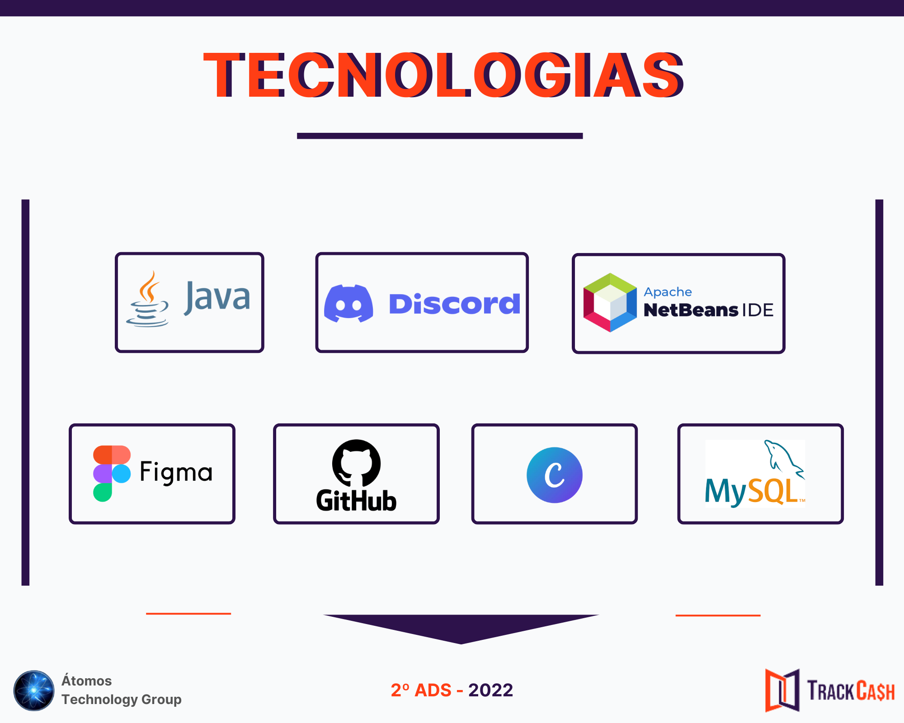

# API-TRACKCASH

<h1 align="center">API 2º Semestre 2022 - Equipe Átomo</h1>

  <a href ="#projeto">Projeto </a>  •
  <a href ="#proposta">Proposta </a>  • 
  <a href ="#prototipo">Protótipo </a>  • 
  <a href ="#cronograma-das-sprints">Cronograma das Sprints </a> •
  <a href ="#backlog-do-produto">Backlog do Produto </a>
   
  <a href ="#backlog-das-sprints">Backlog das Sprints </a>  •
  <a href ="#burndown-das-sprints">Burndown das Sprints </a>  •
  <a href ="#tecnologias">Tecnologias</a>  •
  <a href ="#produto">Produto</a>  •
  <a href ="#modelo-de-dados-relacional">Modelo de Dados Relacional</a>  •
  <a href ="#equipe">Equipe</a> 

 

  
## :clipboard: O Projeto

> **Status do Projeto: Em andamento**
- Nossos clientes são vendedores de lojas online e físicas e para que possamos realizar nosso processo de conciliação financeira precisamos das informações destas vendas, para isso, estes clientes precisam realizar uma serie de configurações - nos dando autorização, para que nossos sistemas possam acessar: apis e planilhas de forma automatizada. Estas autorizações acontecem pela recepção de tokens e usuários de acesso, portanto, este sistema será responsável por salvar estas informações de usuário/senha e tokens.

 

  
## :dart: Proposta

> **Requisitos Funcionais**

- Cadastro de canais (Marketplaces e Meios de Pagamentos)
- Configurações de canais
- Configurações Ativas
 
  
 
 > **Requisitos Não Funcionais**

- Linguagem Java (requisito Fatec)
- Banco de Dados Relacional (requisito Fatec)
- Documentações

 

  
## :bulb: Protótipo

**:link: Clique no link abaixo para visualizar o modelo do projeto.**  
> [Protótipo do Projeto](https://www.figma.com/file/CVTjd7Q6JZlAeHtRpOkRzp/PrototipoTrackCash?node-id=0%3A1)

 

## :calendar: Cronograma das Sprints

<h1 align="center"> </h1>

 

## :pencil: Backlog do Produto

<h1 align="center"> </h1> 

 

## :hourglass_flowing_sand: Backlog das Sprints

<h1 align="center"> </h1> 

 

## :chart_with_downwards_trend: Burndown das Sprints
  
<h3>1ª Sprint</h3>

<h1 align="center"> </h1> 

 
  
<h3>2ª Sprint</h3>

<h1 align="center"> </h1> 

 

  
## :gear: Tecnologias 

<h1 align="center"> </h1> 

 

## :package: Produto

<h3>1ª Sprint - 29/08 a 18/09</h3>

https://user-images.githubusercontent.com/100942191/190927318-888d711f-c1ab-4541-bde9-361190ca7f67.mp4

 

<h3>2ª Sprint - 19/09 a 09/10</h3>

https://user-images.githubusercontent.com/100942191/194786107-55f791e1-a1fd-4db5-bcc8-766697d5571b.mp4

 
  

## :open_file_folder: Modelo de Dados Relacional

<h3>Modelo Conceitual</h3>
    
<h1 align="center"> </h1>

 

<h3>Modelo Lógico</h3>

<h1 align="center"> </h1>

 
  

## :man::computer::woman: Equipe

 

|Nome|Função|GitHub|
| -------- |-------- |-------- |
|**Víctor Henrique**|Scrum Master||
|**Nicholas Guilherme**|Product Owner| |
|**Elisa Carvalho**|Developer Team||
|**Ivan Germano**|Developer Team||
|**João Gabriel**|Developer Team||
|**Rebeca Gama**|Developer Team||
|**Thiago Bueno**|Developer Team||
